# CapEigen

### AI Agentic Underwriting & QAOA Quantum Portfolio Optimization for Real Estate Investment

[](https://www.python.org/downloads/)
[](https://qiskit.org/)
[](https://fastapi.tiangolo.com/)
[](https://vitejs.dev/)
[](https://developers.cloudflare.com/workers/)
[](https://www.postgresql.org/)
[](https://supabase.com/)
[](.github/workflows/ci.yml)
[](#license)

<p align="center">
  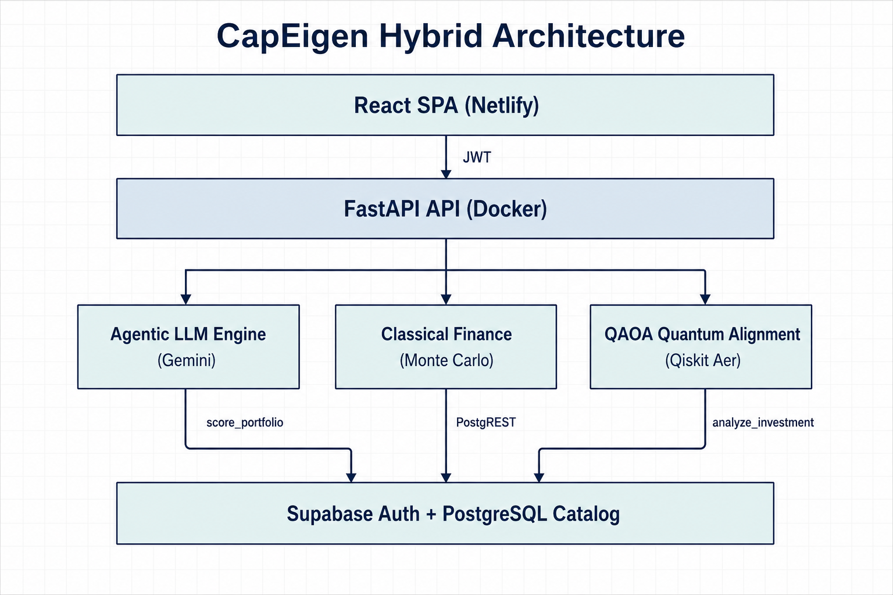
</p>

<p align="center"><em>Figure 1.</em> CapEigen hybrid stack: presentation → API → agentic / classical / quantum cores → local Postgres (Auth on Supabase).</p>

> **For reviewers.** CapEigen is an end-to-end systems project: a production-shaped SPA, authenticated API, self-hosted data plane, agentic LLM research with rate limits and grounding, classical underwriting math, and a reproducible QAOA alignment engine—wired together with Docker, CI, and admin/product tooling rather than left as isolated notebooks.

---

## Table of Contents

1. [Executive Summary](#executive-summary)
2. [Architecture Overview](#architecture-overview)
3. [End-to-End Analysis Lifecycle](#end-to-end-analysis-lifecycle)
4. [Agentic LLM Workflow](#agentic-llm-workflow)
5. [Classical Financial Engine](#classical-financial-engine)
6. [Quantum Alignment Engine (QAOA)](#quantum-alignment-engine-qaoa)
7. [Data Plane & Knowledge Base](#data-plane--knowledge-base)
8. [Auth & Product Surface](#auth--product-surface)
9. [Repository Structure](#repository-structure)
10. [Usage & API Specs](#usage--api-specs)
11. [Testing & Quality Assurance](#testing--quality-assurance)
12. [Further Reading](#further-reading)

---

## Executive Summary

Residential underwriting still leans on static rules of thumb—gross rent multipliers, one-size-fits-all vacancy assumptions, and single-point appreciation guesses—that ignore metro heterogeneity, rent-comp evidence, and the **joint** risk of cash flow versus appreciation.

**CapEigen** (this repository, also known as RealEstateAI) replaces that stack with a **hybrid quantum–classical** pipeline:

| Pillar | Module(s) | Role |
|--------|-----------|------|
| **Agentic research** | `engine.py` | Multi-model Gemini / Gemma chains with Search + Maps grounding, RPM limits, KB-augmented prompts |
| **Classical underwriting** | `finance.py` | Debt service, OpEx, NOI, cap rate, cash-on-cash, rent resolution, tax/insurance normalization, 10-year Monte Carlo appreciation |
| **Quantum alignment** | `quantum_portfolio.py` | Three-qubit QAOA on Qiskit Aer; SciPy COBYLA over (γ, β); histogram → success probabilities |

The product surface is a **React (Vite) SPA** on **Cloudflare Workers** (static assets + auth edge routes) talking to a **FastAPI** backend on the harvest machine (Docker). Property data lives in **local Postgres** behind PostgREST; **login stays on hosted Supabase**. Domain logic lives in root Python modules.

---

## Architecture Overview

### System context

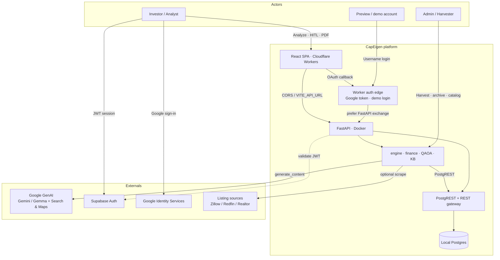

### Logical layers (C4-L2)

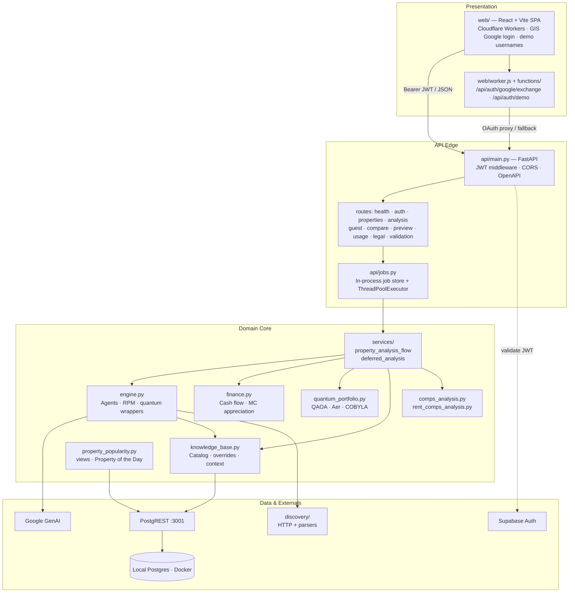

### Deployment topology

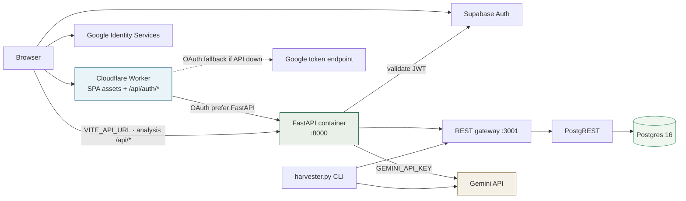

Live product: SPA + auth edge on Cloudflare Workers (`web/worker.js`, `wrangler deploy`); API and database on the harvest machine (`postgres`, `postgrest`, `rest-gateway`, `api` via `docker compose`). Google code exchange prefers FastAPI and falls back to Worker-local credentials if the API is unreachable. Public analysis `/api/*` hits the harvest origin; Postgres and PostgREST stay on localhost.

> **Scale note.** Analysis / quantum jobs are **asynchronous** and stored **in-process** (`api/jobs.py`). Multi-replica API deployments require an external job store (Redis, DB, queue). Poll: `GET /api/analysis/{job_id}`.

---

## End-to-End Analysis Lifecycle

When a user submits an address, CapEigen either **instant-pulls** a catalog hit or runs a full agentic research pass, then queues deferred heavy work (comps → QAOA → forecast chart).

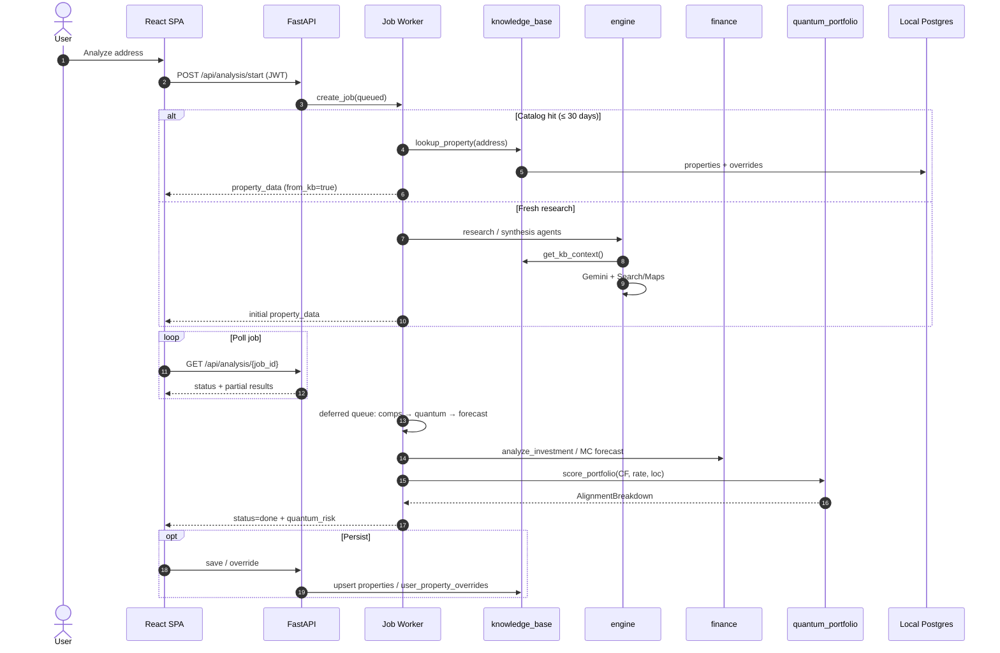

**Deferred task labels** (`services/deferred_analysis.py`):

| Task key | User-visible label |
|----------|--------------------|
| `comps` | Checking comparable sales |
| `quantum` | Running quantum alignment simulation |
| `forecast_chart` | Building appreciation forecast chart |

Finance inputs for QAOA are snapshotted as `(monthly_net_cash_flow, forecast_rate, location_score)` so the quantum stage stays consistent if the user navigates away mid-job.

---

## Agentic LLM Workflow

### Model routing & fallbacks

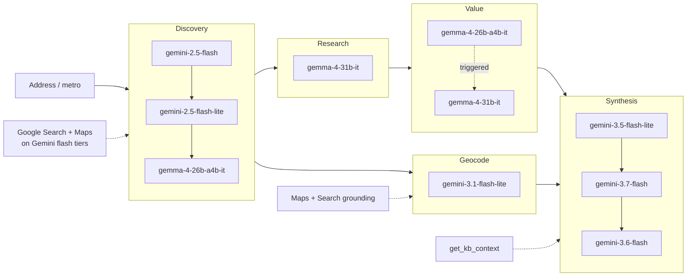

| Role | Primary | Fallbacks |
|------|---------|-----------|
| Discovery | `gemini-2.5-flash` | `gemini-2.5-flash-lite`, `gemma-4-26b-a4b-it` |
| Research | `gemma-4-31b-it` | — |
| Synthesis | `gemini-3.5-flash-lite` | `gemini-3.7-flash`, `gemini-3.6-flash` |
| Property value | `gemma-4-26b-a4b-it` | triggered `gemma-4-31b-it` |
| Geocoding / Maps | `gemini-3.1-flash-lite` | parallel with research; Maps + Search grounding |

Hot-market discovery (`HOT_MARKETS`) targets Upstate NY (Rochester, Syracuse, Buffalo, Albany), Mid-Atlantic (Philadelphia, Pittsburgh), Florida (Orlando, Tampa, Miami), and the Carolinas (Charlotte, Raleigh, Charleston).

### Rate limiting & grounding budgets

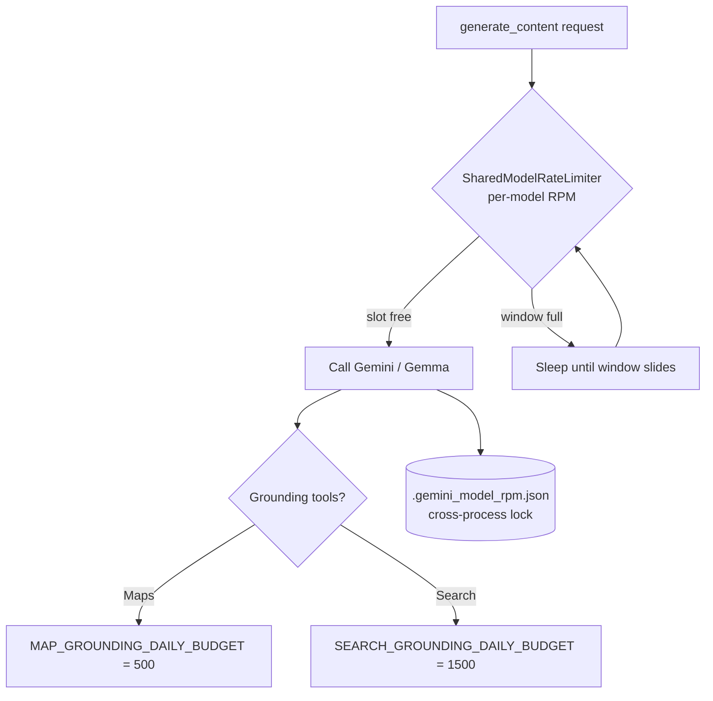

RPM enforcement is **disabled** when `PYTEST_CURRENT_TEST` is set.

Example RPM caps (`MODEL_RPM_LIMITS`): flash `5`, flash-lite `10`, Gemma tiers `13` (default `DEFAULT_MODEL_RPM = 13`).

### Knowledge augmentation

Before synthesis, `get_kb_context(user_id)` injects:

- up to **3** recent analyses (address · market · predicted value);
- up to **50** already-scanned addresses (skip rediscovery).

Instant pull: `lookup_property(address)` against the shared `properties` table (30-day active window) with optional `user_property_overrides`.

---

## Classical Financial Engine

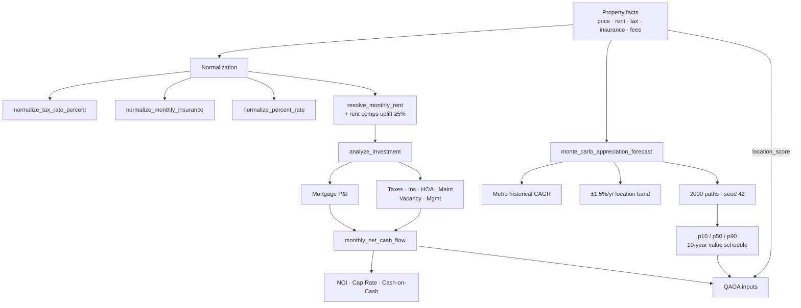

| Concern | Behavior |
|---------|----------|
| **Cash flow** | `analyze_investment` → P&I, taxes, insurance, HOA, maint % of rent, vacancy, management → NOI, cap rate, cash-on-cash |
| **Rent** | Priority: saved → AI baseline → stated gross → rent comps → **1% rule**; rejects price-in-thousands LLM artifacts |
| **Rent comps** | `apply_rent_comps_adjustment` fills missing rent or uplifts when comps show ≥5% underrenting |
| **Sale comps** | `comps_analysis` normalizes comparables; may adjust implied market value |
| **Appreciation** | Metro CAGR + location band; Monte Carlo → p10/p50/p90 schedules |
| **ROI screen** | 1-year ROI > 100% → unreliable (foreclosure-like); KB save may refuse |

Currency outputs in underwriting paths are rounded to **two decimal places** where applicable.

---

## Quantum Alignment Engine (QAOA)

<p align="center">
  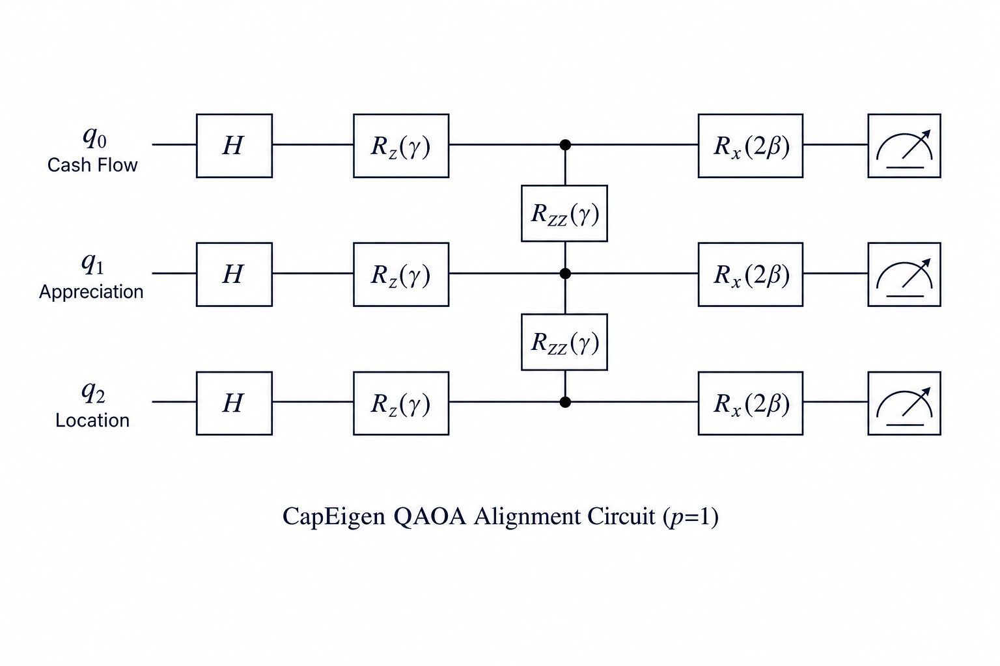
</p>

<p align="center"><em>Figure 2.</em> Depth-1 QAOA circuit: H<sup>⊗3</sup> → cost R<sub>z</sub> / R<sub>ZZ</sub> → mixer R<sub>x</sub>(2β) → measure.</p>

### Module boundary

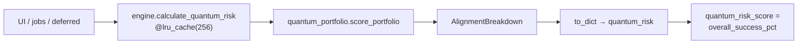

Public library API: **`score_portfolio(PortfolioInputs) → AlignmentBreakdown`**.

### Target encoding

| Input | Normalization *t* ∈ [0, 1] |
|-------|----------------------------|
| Monthly cash flow | *t*<sub>cf</sub> = min(CF / 800, 1); **≤ 0 → 0** |
| Forecast rate (%/yr) | *t*<sub>rate</sub> = clamp(rate / 8, 0, 1) |
| Location score (0–10) | *t*<sub>loc</sub> = clamp(score / 10, 0, 1) |

### Cost Hamiltonian (classical form)

```
C(x₀, x₁, x₂) =
    (t_cf − x₀)² + (t_rate − x₁)² + (t_loc − x₂)²
  + λ [(x₀ − x₁)² + (x₁ − x₂)²],     λ = 0.15
```

### Optimization & measurement loop

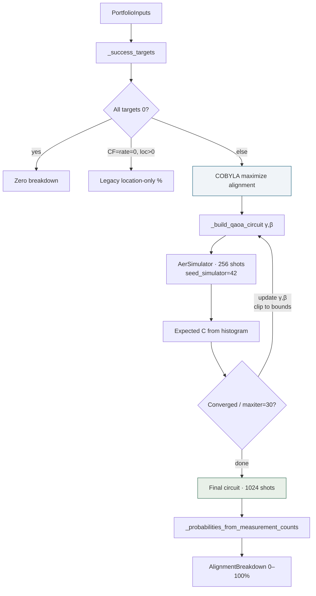

**Parameter search:** `scipy.optimize.minimize(..., method="COBYLA")`, `maxiter=30`, `rhobeg=0.35`, initial (γ, β) ≈ (1.047, 0.524).

**Bounds:** γ ∈ [0, π], β ∈ [0, π/2].

**Circuit layers:** Hadamard → R<sub>z</sub>(γ(2*t<sub>i</sub> − 1)) + R<sub>ZZ</sub>(−λγ) on (0,1), (1,2) → R<sub>x</sub>(2β).

### Score readout

```
CF%        = 100 · t_cf   · E[x₀]
App%       = 100 · t_rate · E[x₁]
Loc%       = 100 · t_loc  · E[x₂]
Combined%  = 100 · t_cf · t_rate · E[x₀] E[x₁]
Overall%   = 0.45·CF% + 0.35·App% + 0.20·Loc%
```

Negative cash flow cannot inflate cash-flow success because *t*<sub>cf</sub> = 0 zeros that term.

> Shipping path uses CPU **`AerSimulator`** for reproducible CI golden values (`seed_simulator=42`).

---

## Data Plane & Knowledge Base

Auth stays on **hosted Supabase**. Catalog, overrides, shares, comps, usage events, legal docs, and preview activity live in **local Postgres** on the harvest machine (PostgREST at `:3001`) when `DATABASE_REST_URL` is set. FastAPI validates the Supabase JWT, then reads/writes local data.

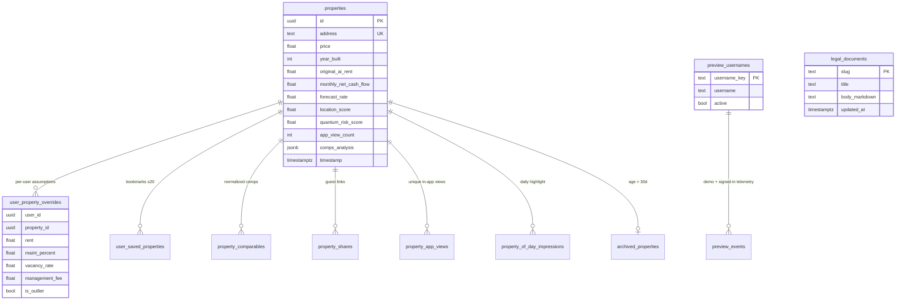

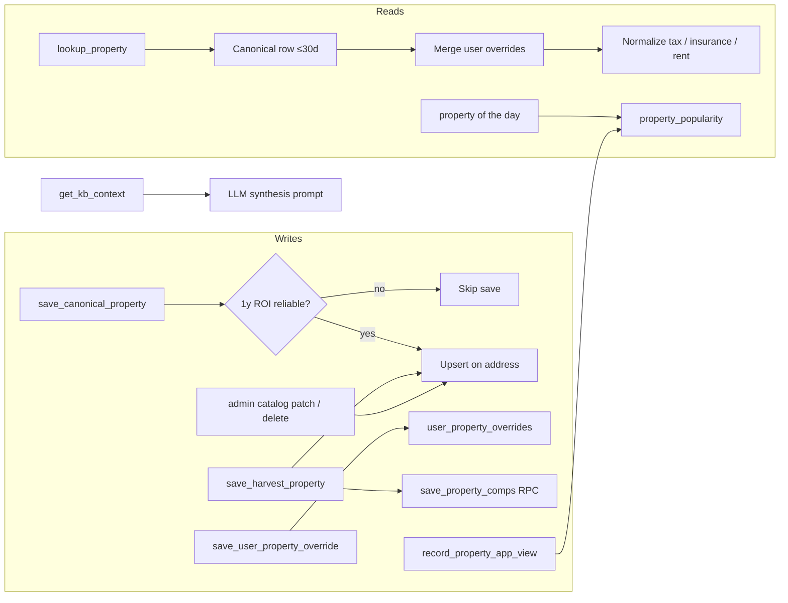

Schema lives in `docker/postgres/init/` and is applied on first Postgres volume create. Harvester / archive paths use **`SUPABASE_SERVICE_ROLE_KEY`** (any non-empty value works against local PostgREST). Admin catalog ownership: **`ADMIN_USER_ID`**.

---

## Auth & Product Surface

| Path | Who | What |
|------|-----|------|
| `/login` | Anyone | Google Identity Services, or allowlisted preview username |
| `/auth/google/callback` | Google OAuth | PKCE callback; Worker proxies code exchange to FastAPI first, Worker-local secret only as fallback |
| `/legal/:doc` | Anyone | Terms / privacy (DB-backed with code defaults) |
| `/` Home | Signed-in | Portfolio map + filter/sort (price, cash flow, cash-on-cash, year built, views); Property of the Day modal |
| `/search` | Signed-in | Individual address analysis; editable assumptions with AI baseline transparency; auto-saves overrides; records unique in-app views |
| `/compare` | Signed-in | Side-by-side underwriting + client-side PDF |
| `/share/:token` | Guest | Read-only share (no login); AI vs displayed assumptions visible, no save |

**Assumption transparency & calibration:** On Individual Search, users see AI-proposed rent, vacancy, maintenance, and management-fee baselines alongside their adjustments (with confidence/source hints). Overrides persist to `user_property_overrides` and feed market-level calibration aggregates injected into future LLM synthesis prompts — no model fine-tuning.
| `/validation` | Admin | Backtesting upload |
| `/activity` | Admin | Preview-account telemetry; add / permanently purge demo usernames |
| `/usage` | Admin | Signed-in usage analytics (audience filter, summaries, CSV export) |
| `/legal-admin` | Admin | Edit and publish legal documents |

Google Web OAuth uses CapEigen redirect URIs (`/auth/google/callback`), not `supabase.co`. Preview usernames are stored in `preview_usernames` (dashboard-managed; fallback `DEMO_USERNAMES`; purged keys stay blocked). Admins can correct or remove harvested catalog rows via the in-app catalog editor.

---

## Repository Structure

```
RealEstateAI/
├── api/                      # FastAPI (health, auth, properties, analysis, PDF, usage, legal, validation)
│   ├── main.py               # App, CORS (incl. *.workers.dev), JWT middleware
│   ├── jobs.py               # In-memory async job store
│   ├── preview_usernames.py  # Demo allowlist + purge list (DB + env fallback)
│   ├── legal_store.py        # Terms / privacy persistence
│   └── routes/               # HTTP surface
├── web/                      # React + Vite SPA
│   ├── worker.js             # Cloudflare Worker: SPA assets + /api/auth/*
│   ├── functions/            # Auth handlers reused by the Worker
│   └── wrangler.jsonc        # Workers deploy (assets + run_worker_first)
├── docker/postgres/init/     # Local schema, roles, RPCs, views / legal migrations
├── docker/rest/              # Caddy REST gateway for PostgREST
├── assets/                   # README figures (architecture, QAOA circuit)
├── engine.py                 # Gemini agents, rate limits, quantum risk wrappers
├── quantum_portfolio.py      # QAOA portfolio alignment (Aer + COBYLA)
├── finance.py                # Cash flow, appreciation MC, normalizers
├── knowledge_base.py         # Catalog, overrides, KB context, admin catalog edits
├── property_popularity.py    # In-app views + Property of the Day
├── comps_analysis.py         # Sale comps
├── rent_comps_analysis.py    # Rental comps + rent uplift
├── harvester.py              # Batch discovery CLI (harvest machine)
├── authenticate.py           # Auth vs data URL split (Supabase Auth / local PostgREST)
├── discovery/                # Listing source adapters & parsers
├── services/                 # property_analysis_flow, deferred_analysis
├── validation/               # Backtesting helpers
├── scripts/                  # e.g. migrate_supabase_to_local.py
├── docs/                     # DEPLOY, HARVESTER_SETUP, LOCAL_POSTGRES
├── test_app.py               # Domain / quantum / finance / KB tests
├── test_api.py               # API tests
├── docker-compose.yml        # postgres · postgrest · rest-gateway · api
├── Dockerfile
└── .env.example
```

---

## Usage & API Specs

### Portfolio alignment (library)

```python
from quantum_portfolio import PortfolioInputs, score_portfolio

breakdown = score_portfolio(
    PortfolioInputs(
        monthly_cash_flow=1000.0,
        forecast_rate=10.0,
        location_score=10.0,
    )
)

print(breakdown.overall_success_pct)
print(breakdown.to_dict())
# cashflow_success_pct, appreciation_success_pct,
# location_success_pct, combined_wealth_success_pct, overall_success_pct
```

### Application wrapper (cached)

```python
from engine import calculate_quantum_risk, clear_quantum_risk_cache

risk = calculate_quantum_risk(500.0, 5.0, 5.0)  # CF, rate %, location 0–10
assert 0.0 <= risk["overall_success_pct"] <= 100.0

risk = calculate_quantum_risk(
    cash_flow=800.0,
    forecast_rate=6.5,
    location_score=7.0,
)

clear_quantum_risk_cache()  # before tests that patch the optimizer
```

With Aer seed `42` and COBYLA `maxiter=30`, “perfect” inputs `(1000, 10, 10)` are pinned in `test_app.py` (overall ≈ **50.25%**).

### HTTP surface

| Area | Role |
|------|------|
| `GET /api/health` | Liveness; `data_backend` is `local-postgres` or `supabase` |
| `GET /api/me` | Current user, admin / preview flags |
| `POST /api/auth/google/exchange` | Google OAuth code → session (FastAPI primary; Worker edge can proxy / fall back) |
| `POST /api/auth/demo` | Preview-username login |
| Properties / portfolio | Catalog search, detail, bookmarks, overrides, year built |
| `POST /api/properties/view` | Record unique in-app property view |
| `GET /api/property-of-the-day` | Deterministic daily highlight (timezone-aware) |
| `PATCH` / `DELETE /api/admin/properties/{id}` | Admin catalog metric edit / remove |
| `POST /api/analysis/start` | Auth underwriting job; poll `GET /api/analysis/{job_id}` |
| Guest / compare PDF | Share links, export |
| `/api/usage/*` | Admin usage summary + activity feed |
| Legal | Public read + admin update for terms / privacy |
| Preview activity | Admin telemetry + username allowlist / purge |
| Validation | Admin backtest upload |

OpenAPI: `/docs` when the API is running.

---

## Testing & Quality Assurance

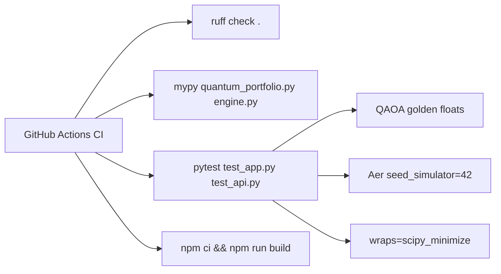

| Layer | Location | Focus |
|-------|----------|-------|
| Domain / quantum | `test_app.py` | Goldens, bounds, determinism, finance MC, rent/tax normalizers, KB, discovery, deferred analysis, admin sanitization |
| API | `test_api.py` | FastAPI routes, preview usernames / purge, property views, Property of the Day, usage / legal |
| Lint / types | Ruff + mypy | Core modules |
| Frontend | Vite production build | `web/` |

**Quantum instrumentation:**

- Golden snapshots for perfect / average inputs under seed `42`
- `patch("quantum_portfolio.minimize", wraps=scipy_minimize)` — assert COBYLA call/skip
- `patch.object(AerSimulator, "run", ...)` — assert `seed_simulator=42`
- `clear_quantum_risk_cache()` before uncached QAOA assertions
- Gemini / Supabase mocked; CI uses `GEMINI_API_KEY=fake_key_for_ci`

---

## Further Reading

| Document | Contents |
|----------|----------|
| [`docs/DEPLOY.md`](docs/DEPLOY.md) | Cloudflare Workers SPA + harvest-machine API |
| [`docs/LOCAL_POSTGRES.md`](docs/LOCAL_POSTGRES.md) | Self-hosted Postgres / PostgREST |
| [`docs/HARVESTER_SETUP.md`](docs/HARVESTER_SETUP.md) | Batch harvester + Task Scheduler |

---

## License

Proprietary unless otherwise stated by the repository owner. Contact the maintainers for redistribution terms.
